OKTA Application Setup and Configuration
=============

Okta is leading provider of secure identity management with Single Sign-On, Multi-factor Authentication, Lifecycle Management (Provisioning), and more. Okta simplifies access to various parts of an application by managing roles within groups were users belong to more than on groups.
In this tutorial we will be creating a sample Okta application, adding a Authorization server and other details. Below are the steps to follow to setup/configure an Okta application.

* Create Okta developer account by signing up into [developer.okta.com](https://developer.okta.com/signup/) and login.

* In Okta Admin Dashboard menu, go to **Users** tab in the menu and then click **Groups**. Click **Add Group** and enter **admins** in the Name field and add a group description, like: Admins. Click Add Group to create new **admins** group. Similarly create a new **users** group.

   

* Again, navigate to Users in the Okta Admin Dashboard, but this time click People. Click Add User and fill in the form with the user information. Use a real email address for either the primary or secondary email address and one that you have access to, so that you can validate the email later. In the Groups field, add this users to both the admins and users group you created earlier. Make sure you’ve clicked the Send user activation email now checkbox and then click “Save and Add Another”.

   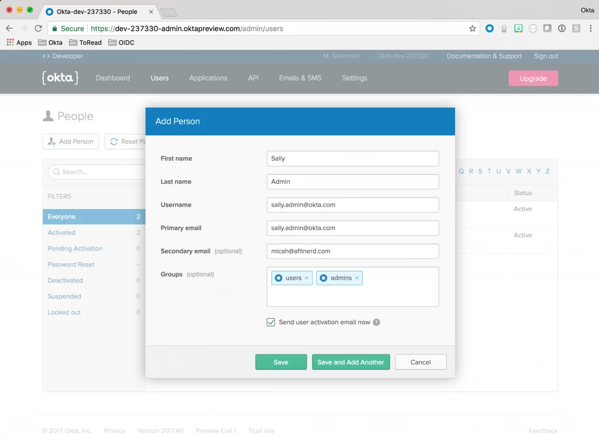

* Go to Applications tab in top menu item and then click on **Add Application**. 

   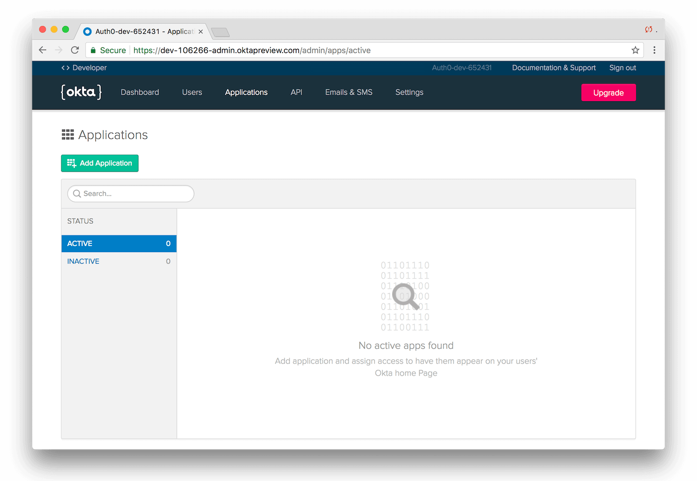

* You should see the following screen. Click on the icon for the **Web** option. Click Next.   

   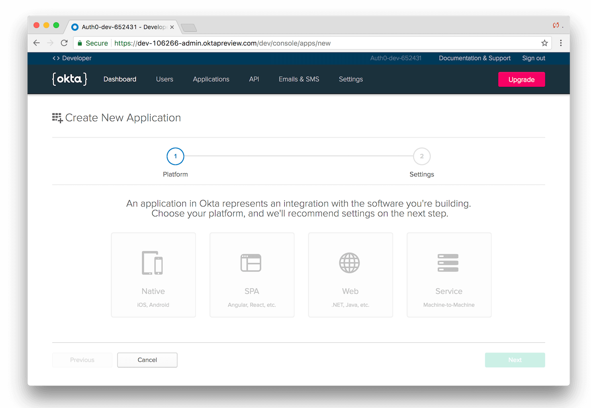
   
* Update the configuration options with description name, login redirect URIs and select **Grant types** Client Credentials, Authorization Code and Implicit. Click done to create the Okta Application.

   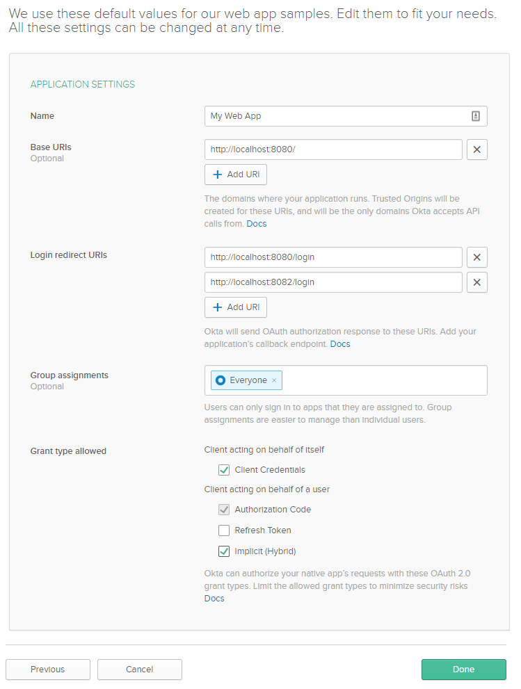
   
* Once the Okta application is created click to open the new Spring MVC application. Copy the **CientID** and **Client secret** from the application configuration (at the bottom); and replace **${OKTA_CLIENT_ID}** and **${OKTA_CLIENT_SECRET}** with copied **CientID** and **Client secret** values respectively.

   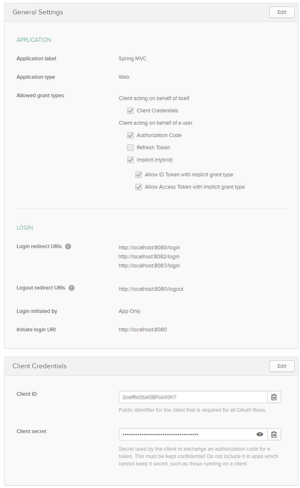
   
* Next we configure a custom [Authorization server](https://developer.okta.com/docs/guides/customize-authz-server/create-authz-server/). To do so, click the API menu item and then select Authorization Servers tab. You will see the list of Authorization server configured in Okta.
   
   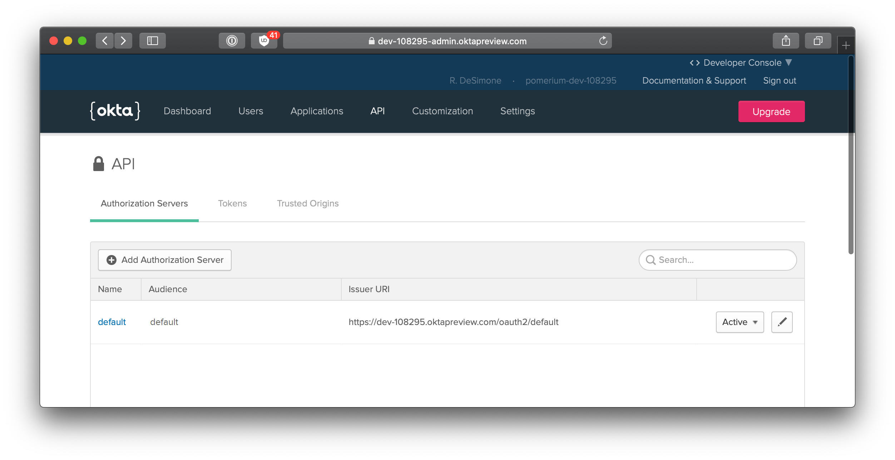
   
* Click on **Add Authorization Server** to open the form. Enter **Name**, **Audience** and **Description** of Authorization Server and press save to create the new custom Authorization Server.
   
   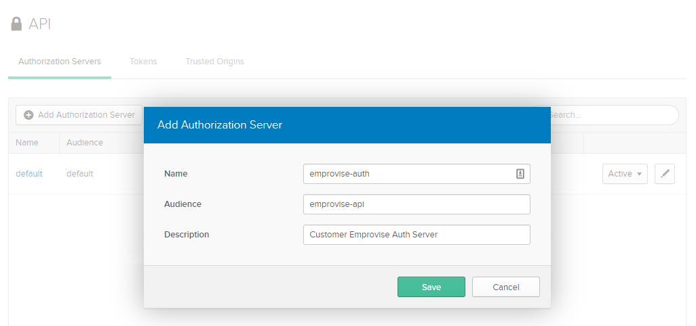
   
* On clicking of the new Authorization server e.g. **emprovise-auth** in this case, open the settings. Copy **Issuer** URL and replace **${OKTA_ISSUER_URL}** in all spring application.yaml files with this copied **Issuer** URL.  
   
   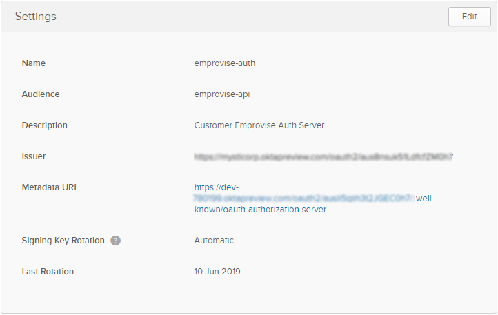
   
* [Access policies](https://developer.okta.com/docs/guides/customize-authz-server/create-access-policies/) are containers for rules. Each access policy applies to a particular OpenID Connect application, and the rules it contains define different access and refresh token lifetimes depending on the nature of the token request. Navigate to API > Authorization Servers tab and select the name of an Authorization Server for which access policy is created. 
Once the Authorization Server name is selected e.g. **emprovise-auth** in this case, go to **Access Policies** tab and click on **Add Policy**.
   
   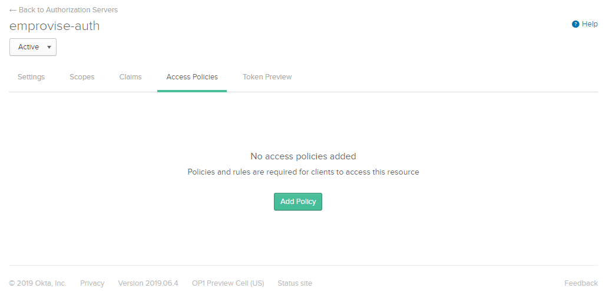
      
* In the **Add Policy** form enter the name and description of the new access policy. Then enter the name of Okta application in the **Assign to** field to which this new policy will be assigned. Click **Create Policy**.  
   
   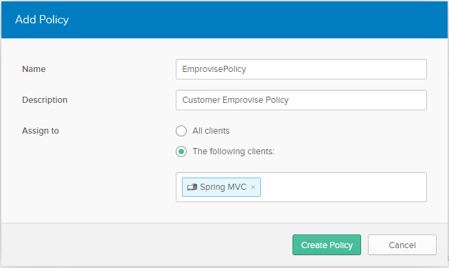
      
* Once new policy is created you will see the various rules which could be added to the access policy.  
   
   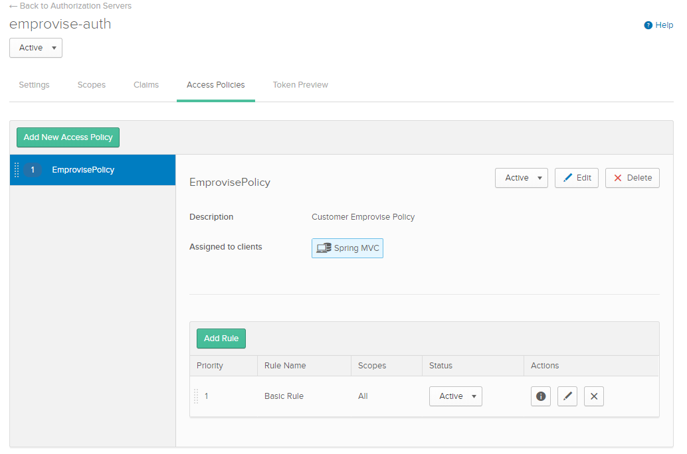
