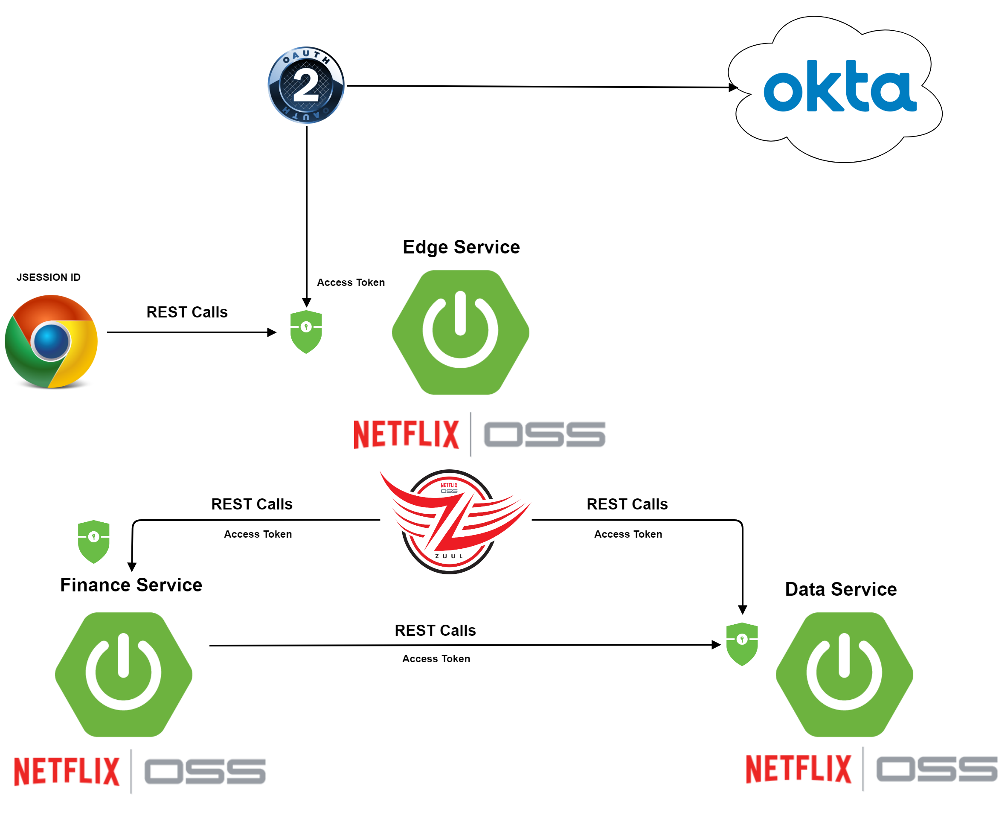

## Spring Okta Microservices

Spring Okta Micro services demonstrates a prototype of Okta security with micro-services. 
In this design the edge service (using Netflix Zuul) acts as a gateway/router for all the client requests. Although all the micro-services namely edge-service, finance-service and data-service are enabled with Okta security, the user authentication is primarily done by edge-service as it acts as a router for all the client requests.
Once client request is authenticated using OpenID and Authorized using OAuth2 by Okta Auth server, it returns an access token to the edge-service which stores it in SecurityContext which is part of HttpSession. 
Once the request is authenticated the edge service determines which micro-service to route the request using request path and Zuul routing configuration. For example all the requests matching **/finance** URL are routed to finance-service (localhost:8082) while all the requests matching **/data** URL are routed to data-service (localhost:8083).
As the edge-service (Zuul) routes these requests it also adds the Okta access token as Bearer auth in the request header so that Okta security layer of finance-service or data-service will authenticate/authorize the request using Okta Auth server and accept the request.
The individual micro-service sends the response to gateway which returns the response to the client along with JSessionID. The client uses this JSessionID to send the subsequent requests to the edge-service.
The edge-service identifies the session and retrieves the SecurityContext object from HTTPSession and the Okta access token to pass to the corresponding micro-service.
The client never sees the actual the micro-service host or service path, it only sees the service URL to the edge-service though which it interacts with the cluster of micro-services.
When these micro-services talk to each other they pass the access token present in the original http-request to the respective micro-service thus allowing the Okta security of the micro-service to authenticate the request. 
To better load balance the requests it would be better for all micro-services to go through edge-service (Zuul) instead of invoking the micro-service directly. Also leveraging [Netflix Eureka](https://github.com/Netflix/eureka) to call micr-service by serviceId would also be ideal.
The disadvantage of this approach is every request to micro-service is authenticated again with Okta Auth server even though the original request was already authenticated/authorized by edge service thus degrading the overall performance. To avoid this a client token authentication approach could be applied.    

   

### Spring SecurityContext and HttpSession

The HttpSessionSecurityContextRepository uses the httpSession (Key="SPRING_SECURITY_CONTEXT") to store an SecurityContext Object. 
The SecurityContextPersistenceFilter is an filter that uses an SecurityContextRepository for example the HttpSessionSecurityContextRepository to load and store SecurityContext Objects. 
If an HttpRequest passes the filter, the filter get the SecurityContext from the repository and put it in the SecurityContextHolder (SecurityContextHolder#setContext). 
The SecurityContextHolder has two methods setContext and getContext. Both uses a SecurityContextHolderStrategy to specify what exactly is done in the set- and get-Context methods. 
For example the ThreadLocalSecurityContextHolderStrategy uses a thread local to store the context. Hence the user principal (element of SecurityContext) is stored in the HTTP Session. 
For each request it is put in a thread local from where it can be accessed.
